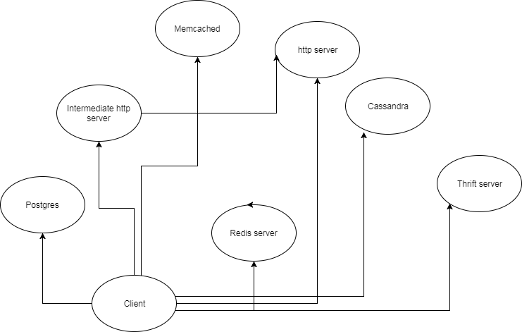

Netil Demo app. 

Netsil demo app is the client-server app written in Python. 

## Architecture
-----

## Usage
-----

Netsil creating external client.
-----

- to start client from outside of the cluster, please use following steps:

1) get external ip's of the all service using command: kubectl get services
2) Each service will be assigned an external ip. Copy those in the following command:
 ''' docker run -d -e "DEMO_APP_HOST=104.155.148.71" -e "MYSQL_HOST=<ip_address>" -e "REDIS_HOST=<ip_address>" -e "THRIFT_SERVER=<ip_address>" -e "POSTGRES_HOST="<ip_address>" -e "MEMCACHED_HOST=<ip_address>" -e "CASSANDRA_HOST=<ip_address>" harshals/netsil_client '''

Script to start the cluster
------
sh kubernetes/startcluster.sh - this will 
      - create deployment
      - create services
      - create configmap

Script to delete the cluster
-----
sh kubernets/destroycluster.sh - This script will delete the cluster.

Update config map
-----
sh kubernetes/updateconfigmap <configmap.yml file path> - This script will update the config map in k8s cluster and refresh the pods. 